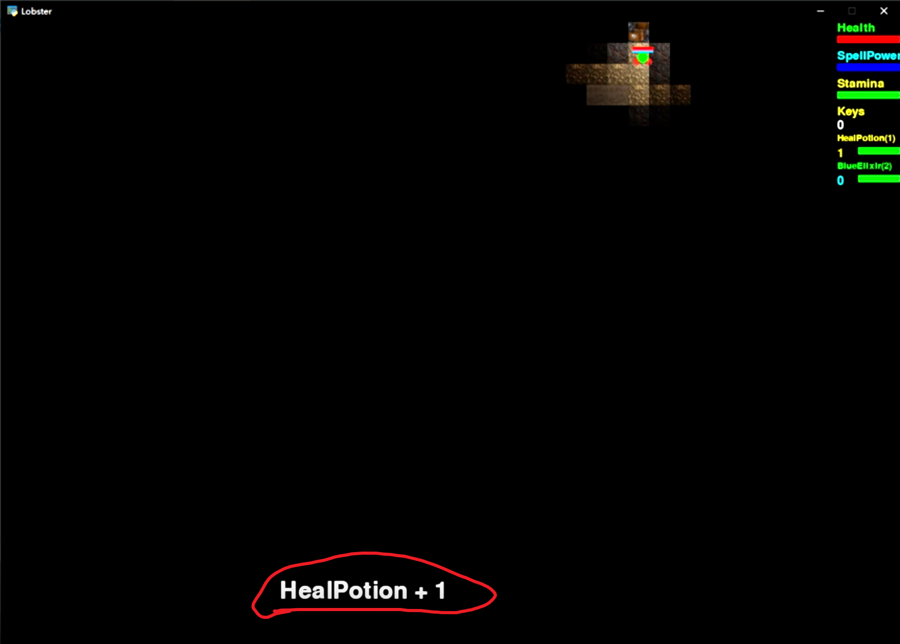

# [Lobster-Remake](https://github.com/DiceSpinner/Lobster-Remake) (2021 May - 2021 Sep)

### BackGround 
A remake of the 2D Top Down dungeon exploration game I've developed in Grade 11 using pygame. More information and clips of this game are available on the github repo. The project started after my first year at University of Toronto doing computer science by the moltivation of putting the knowledge I newly gained to test. In the four months I had in summer I managed to implement the majority of the gameplay features from the original game with greatly improved flexibility, as well as some new features. In the following sections I will start with reviewing what the original game had and then move on to the improvements and changes made in this remake. Also you can check out the github repo for more clips and demonstrations of the features.

### Camera
The camera in the oringal game is static and does not move along with the player. The size of the screen is hard coded to fit in the entire map and the UIs.

In the remake the camera is not adjusted to fit in the whole map and can move along with the player. The range of visibility is adjustable with zoom in/out supported. It also recognizes the edge of the map and remains static in x, y axis until the player moves out.

### Player Actions
In the original game the player is able to perform the following actions:

- 8 Directional Movement
- Spend mana and stamina to launch a fireball that explode upon collision with solid object or timeout, causing damage to nearby enemies
- Use stamina to melee attack that deals damage to all enemies in the vicinity
- Consume health potion to gradually restore health
- Consume mana potion to gradually restore mana
- Consume a key to unlock a door
- Open a chest to collect item
- Pick up item on the ground while passing through
    - The set of items is hardcoded, the inventory is represented by a bunch of counters for each item
    - If it is a buff potion, consume it and gain the corresponding buff in speed/damage.
    - Otherwise increase the counter of the corresponding item by 1
- If collected 2 spellbooks, the fireball will be empowered and can destroy some walls
- Teleport to some other location while standing on top of a portal

In this remake, the player is able to perform the following actions:

- 8 Directional Movement
    - The player can still only do 8 directional movement due to input constraint, however the entities like fireball and npcs are able to move in all dirctions
    - The movespeed is constant in all directions while in the original game you gain speed by moving diagnally
- Mouse tracked aiming (New)
- Spend mana to launch a fireball that explode upon collision with solid object or timeout, dealing damage to nearby enemies
    - Fireball now inherits the launchers velocity, if the player is sprinting while launching, it will go faster or slower towards the target based on player velocity.
- Melee attack that deals damage to all enemies in the vicinity
- Interact with interactable objects
    - Open / Close Doors
    - Pick up items and add it to the inventory
        - Inventory can be customized to impose size restriction
        - Items can be defined in the text file and imported into the game
- Consume stamina to deal damage to nearby enemies
- Reduce stamina regeneration to generate a shield that reduces damage taken (new)
- Continuously decrease stamina to increase movespeed (new)
- Zoom in/out camera (new)

<video width="320" height="240" controls>
  <source src="../mp4s/RemakeActions.mp4" type="video/mp4">
</video>

Regarding the entity actions, a simple ability system is implemented. A priority queue is in place to hold all active ability instances and they will be executed by the assigned order. Abilities can be defined in separate classes as methods and entities can acquire them by inheriting the corresponding classes. 

### Define & Modifiy Entity/Map/Item/Tile Attributes
The tiles, items, entities and maps can be defined and their properties can be customized via text files using the deserializer I had created. It is capable of constructing nested objects using recursive deserialization, bool expression evaluation and referencing predefined constants in addition to primitive types like int, float, bool, string, etc. 

*Change the solid property of the player to allow wall walking*

*Define and Add a new tile with image of the cursor*

### Collision Handling

The original game supports collision detection beween any combination of axis aligned squares and circles. At the beginning the framerate is not ideal, and the biggest bottleneck is the entity vs tile collision detection. The original 30 by 40 map has 1200 tiles and it is not feasible to check for collision with all of them for each moving entity. Here it is assumed the size of every entity is less than the predefined tile size in order to simplify the collision detection. Since every entity is no bigger than 1 tile, each moving entity only needs to check for collision with the nearest 9 blocks surrounding it. With the limitation of the max number of moving entities alive, the collision detection calculations are greatly reduced. 

When the player collides with a solid object, we want it to stop moving in its direction, but we also don't want to lock the player in place. So 4 flags are there to represent the direction where the player is restricted. When detecting a collision, the game will check the direction the collided object from the player's point of view and set the appropriate flags. And that enables the player to slide along the wall.

In this remake, the supported shapes that can collide remain unchanged. Improvements were made to allow the system to hande collision detection of entities with any size without having to go through every tile in the map. The map is broken down into tiny spaces the same size as tiles. An entity is said to occupy one of such space when its axis aligned bounding box is collided with this tiled space. Each of the tiled space will keep a set of entities that occupies it and conversely each entity will keep a record of the set of tiled spaces it occupies. To get the list of tiles/entities the entity is colliding with we just go through the union of the sets of the occupied tiles and apply collision detection algorithm for the correct shape pair. For performance, we only update this occupation status of entities that is capable of moving each frame.

In the remake the entities are capable of moving in all directions. The velocity of the entity is broken down into xy components. The game uses the normalized xy components as step size and will continuously swap between stepping in x and y directions until the desired displacement of the current frame is completed. The frequency of x and y steps varies based on the velocity direction. When a collision is detected after taking the step, the step is undo and the game continues with stepping in the other axis. 

### Tile Based Lighting and Lazy Drawing

The above image desmonstrate how brightness are calculated in the original game when the light source emits brightness of 3. Each tile is represented by a cell here, and the number indicates the calculated brightness. Here at the center locates the light source. We start from this cell and slowly expands outwards, decrease the brightness by 1 for each tile traveled and stop if the brightness we wish to assign is 0 or less than the original brightness of the current tile.

The original game only has 5 light levels for each tile. Every frame the brightness of tiles are reset to 0 and every entity that can emit light will go through the computation to raise the brightness of nearby tiles. The brightness decreases by 1 for each manhattan tile distance away from the tile the center of the entity is on.

For each tile, images of itself at 5 different brightness is manually computed using tools online and saved to the local folder. The rendering algorithm chooses the image that reflects the current brightness level to render by indexing the array of 5 images of the current tile with the current brightness level. This is super inefficient, inflexible and will take a lot of space on disk. Additionally, I did not understand the importance of caching the images as local variables and had read from disk every time a tile is drawn. This absolutely destroyed the framerate of the game and I had to resort to lazy update on drawing tiles. 

This optimization also originate from the same assumption: No entity is bigger than the tile. Simply put, the game only draws tiles that are actually changing brightness every frame, since only entities can emit lights and move, we only draw 9 tiles around every entity. But that was not enough. The character emits light that can travel at variable number of tiles, and we want tiles whose brightness got changed to get redrawn. And so, the rendering algorithm was patched to redraw the tiles around every entity that can emit light. It runs along with the lighting algorithm, adding the enlighted tile to the draw list. 

Now that we have ensured the tiles lit are drawn, we also need to overdrawn tiles that are no longer lit. The solution to this in the original game was to limit the speed of the entities such that they can't travel more than 1 tile per frame in x or y direction. The rendering algorithm extend 1 block further on top of the lighting algorithm to make sure the old tiles enlighted are blacked out again. The colored tiles from the above figure are the ones that gets draw. 

What the original game did not address is when the entity moves diagnally, it can actuall move through 2 tiles in 1 frame, causing some unlit tiles to not get overdrawn.

In the remake, the lighting algorithm remains mostly the same, except for the fact that tiles can have different light absorbtion and light source entities lights up tiles it collides with in addition to the tile where its center is located.

Also since the camera can move every frame, everything on the screen needs to be redrawn every frame so lazy drawing cannot be used here, and therefore we're not going to have the above artifact here. To display a block of its corresponding brightness, instead of manually image editing for every possible value of brightness, a dark shade is drawn on top of the tile with its alpha value set to `255 - brightness`. When the brightness is 0, the dark shade will be opaque and completely cover the tile image and when the brightness is `255`, the dark shade will be invisible. The brightness level is unbounded, however if the brightness of a tile is above `255`, it'll be rendered as if it's `255`.

*Light Absorbtion of tiles set to 40*
 

*Light Absorbtion of tiles set to 100*

### UI
Lazy drawing worked out well for some time, until I started working on displaying respawn counter UI which is drawn on top of the map where player is not active. The approach I took was simply checking if the player position is on top half of the map and draws the UI message on top half of the screen, otherwise draws it at the bottom half of the screen.

However, When the player is switch between top and bottom half of the map, UI texts gets rendered on both top and bottom half of the map, and since the tiles there are not redrawn, the text remains there until it is overwritten by another prompt.

I have not implemented any other UI in the remake other than the simple ones you can see from other clips due to time constraint, but this kind of problem should not occur because we're not doing any kinds of lazy drawing here.

### Current Status

Unfortunately I dived too deep into making the foundations and did not leave enough time for actually design and implementing game levels as well as some other systems like user interface and input handling. The game is still largely unfinished. I've only managed to create the general structure of how things should be filled in. As of now, this project is not of high priority to finish not only because I've got other more important tasks at hand but also because it has already served its purpose well as I've gained valuable software engineering experience. I realized there are issues with the current system layout and it could use a complete redesign when I get back in the future. 