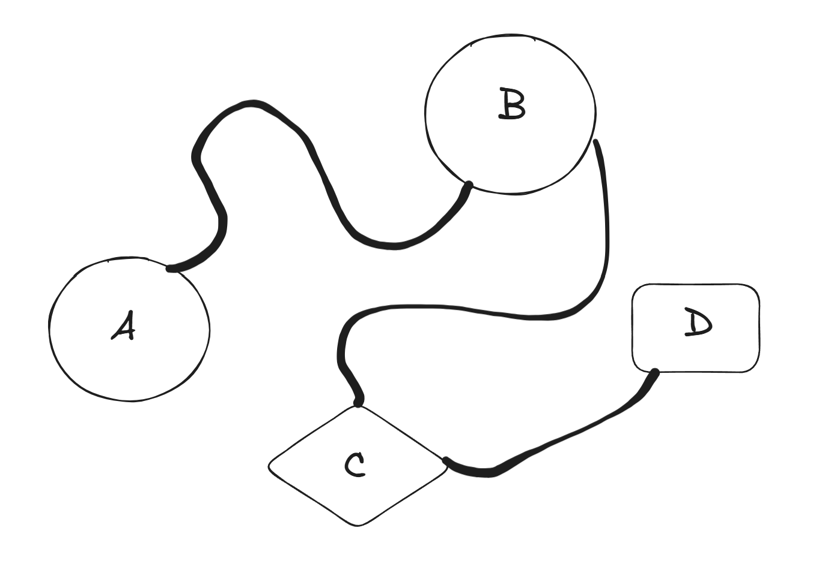
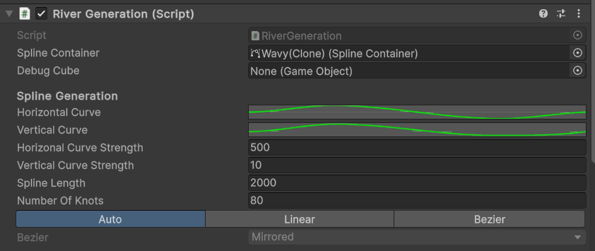
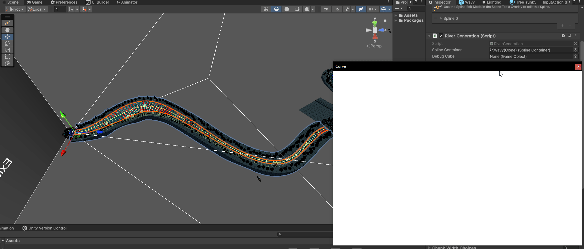
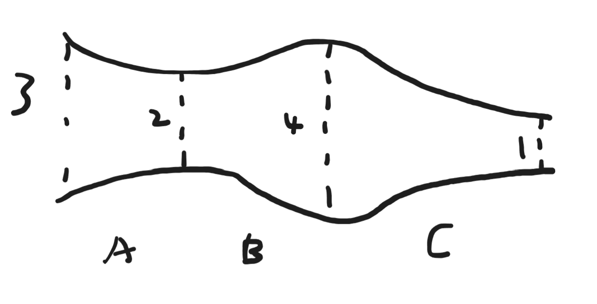
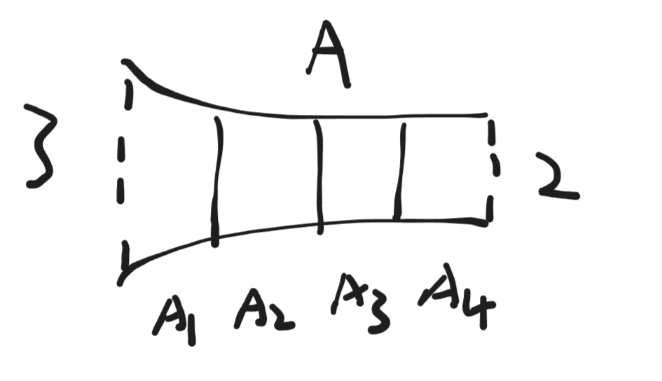
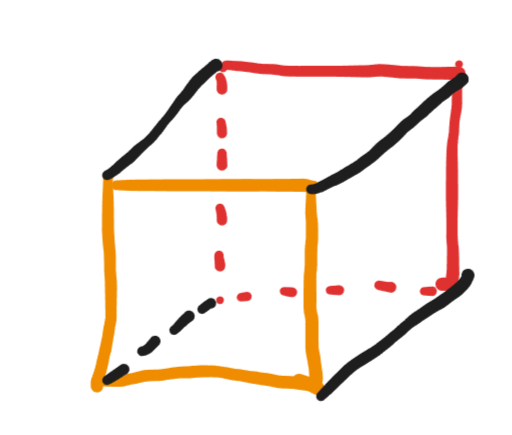

# Salmon
A 3D racing/adventure game where you play as a salmon developed using Unity game engine. At the moment this project is being activly developed as the course project for CSC404 2024 Fall. I'm contributing to this project as a programmer. Down below I'll go over the gameplay and features with an emphasis on procedural map generation which is what I've worked on the most.

# Gameplay
The player will play as a salmon whose goal is to swim upstream and reach the end of the river to lay eggs. The path will not be simple and in addition to the map complexity, various hostile creatures such as bears and eagles will join together to hunt the player. When the player dies to one of these creatures, the game will pause and allow the player to choose to respawn as another salmon and continue. The map will be procedurally generated so the play experience is going to vary everytime which adds a lot to the replayability.

# NPCS Creatures

Below are the basic descriptions of the creatures in this game. They are subject to changes until this course is concluded.

## Fish (NPC)
These are the fellow companions of the player. They will attract attention from hostile creatures for the player. In a regular salmon run many salmons will be killed and this adds moer weight to the theme of the game.

## Bear
A hostile creature who'll sit on sides or middle of the river to try to grab any salmons passing through. Getting caught by one of them means instant death!

## Eagle
A hostile creature who'll try to catch the player whenever close to the water surface or out. The player will have the option to break free from the grab. However, the player will die if the eagle manages to take the player back to its nest.

## Fishermen
These are skilled hunters who are great at predicting the player's movement. When the player gets in range they'll throw a fishing hook towards the player after an alert sound cue and wind up time. Getting caught by the hook will cause the player to take damage. If the salmon is low on health it'll be picked up by the fishermen, with death awaiting ahead.

# Procedural Terrain and Level Generation
The game employes procedural map generation. When the level is launched the game will spend some time generating the map. At the moment it is decided to stick with this model as runtime map generation requires some more optimization and we're limited by the time constraint of this course. For prototyping, I have made the editor tool to generate the map manually inside the editor so the team can experiment with different parameter settings.

<video width="900" height="600" controls>
  <source src="../mp4s/salmon_map_generation.mp4" type="video/mp4">
</video>

## Level Generation

A level consists of various events with rivers connecting them. Each event consists of an entrance and an exit. From the above graph we have 4 events connected by rivers. To generate a level, we need to first pick the starting event, in the above example, `A`. An instance of `A` is generated as the start of the level.  Then, starting from the event `A`, we randomly choose `B` as the next event after `A` and a preconfigured river generators to generate the river in between. After that, the chosen river generator will be fired to generate the river, and it'll be placed on the exit of event `A`. Lastly we generate an instance of `B` and place its entrance by the generated river. From `B` we can repeat this process to generate `C` and so on. The parameter `numEvents` on the generator specifies the number of events to generate in addition to the start event, in the above case, we have 3 additional events.

## River Generation
The river generation consists of 4 stages: Spline Knot Placement, Chunk Depth/Width/Position Calculation, Mesh & Collider Generation and finally Prop & Creature placements. Below we will go through each stage separately.

### Spline Knot Placement
The river is modeled using a spline which models a [bezier curve](https://en.wikipedia.org/wiki/B%C3%A9zier_curve). Unity provides a spline package out of the box so here we're using the unity spline to represent the river. The spline is made up of various number of bezier knots, which will act as control points of the bezier curve. Here the river length and shape can be specified:

Some parameters here are self explanatory, the horizonal and vertical curves defines how the splines looks like from top/side. And curve strengths define how much the curve should influence the shape. The number of knots specifies how many knots you wish to put down to simulate this curve. The higher the number the more precision you get, but the generator will be less performance since Unity Spline utitlies runtime scales with the number of knots in the spline.

### River Chunk Width/Depth/Position Computation
We want the river to have variation in widths and depths at various parts. The river spline is broken down into various chunks of equal size.

Here we have the river broken down into 3 chunks looking from a top down angle. Each chunk has an entry width and an exit width. Note that the entry width of the next chunk is the same as the exit width of the current chunk. The width within the chunk will be a lerped value from the entry width to the exit width. The lerp value is defined as a curve. The below figures will demonstrate these ideas.

Here each river chunk is further broken down into various subchunks. Subchunks only have 1 width which is the lerped value from the start width to the end width of the parent chunk. The position of the subchunk is its local position on the spline, which is computed via `SplineUtility.EvaluatePosition(Spline, float)`, in which the interpolation ratio `t` is the index of the subchunk divided by the number of subchunks. As an example, assume we have linear lerp factor function, the lerp factor of `A1-A4` is 0, 0.25, 0.5, 0.75, which means their widths is 3, 2.75, 2.5 and 2.25. The depths computation works in the same manner.

You can specify the number of chunks and subchunks in the river. More chunks allows you to have various width/depths variation and more subchunks will increase the precision of the mesh model which will be generated in the next stage. You need to specify the choices that will get randomly chosen as the entry/exit width of chunks as well as the start and the end width/depth. The start and end width/depths can either be manually chosen if you're doing manual river generation or can be automatically set by the level generator during level generation. These are very important since they allow us to match the width/depth of the river to the width/depth of the entrance/exit of the river event to have them connect seemlessly.

### River Mesh/Collider Generation
In this stage we make use of the information from the last stage to generate triangles and vertices for the river mesh and create box colliders to appoximate the river collider.

The above figures demonstrates how mesh vertices are formed. The blue points are sample positions of the spline, which is also the positions of the subchunks. Using this as the starting point, a quad will be computed for each subchunk plus 1 additional for the end of the river. Then, each pair of neighbouring quads will be stitched together forming a box. The 6 faces of the box will have 2 triangles the same as a regular cube in Unity and assigned normals and uv coordinates for each triangle vertices.

To be continued...
