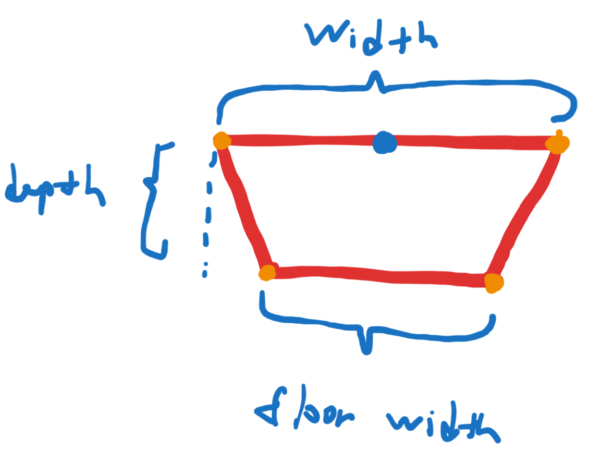

# Salmon
A 3D racing/adventure game where you play as a salmon developed using Unity game engine. This is the course project for CSC404 Game Design at University of Toronto. I'm contributing to this project as a programmer. Down below I'll go over the gameplay and features with an emphasis on procedural map generation which is what I've worked on the most.

The game is hosted on [itch.io](https://cuppajoeman.itch.io/salmon), and the trailer can be viewed [here](https://www.youtube.com/watch?v=-Hlf1usRD6Y&feature=youtu.be).

## Gameplay
The theme and the goal of this game is very simple. The player is a salmon who wish to reproduce and is on a journey to the upstream of the river. The game ends when the player reaches this destination. To do this the player is required to get familiar with the semi-physics based movement and manuover around the obstacles in the environment. In addition, there will be creatures preying on the player acting as the challenges throughout this journey. When the player gets caught by the creatures or dies by staying out of water for too long, the game will restart from the closesting checkpoint.

The game also features a local multiplayer mode where 2 players can race against each other to be the first on to reach the end of the map. When the game starts the map will be procedurally generated in real time to provide variance to the game sessions as well as adding replayability.

<video width="900" height="600" controls>
  <source src="../mp4s/salmon_gameplay.mp4" type="video/mp4">
</video>

## NPCS Creatures
### Bear
A hostile creature who'll sit on sides or middle of the river to try to grab any salmons passing through. Running into their claws will cause the game to restart at closest checkpoint.

### Eagle
A hostile creature who'll try to catch the player whenever close to the water surface or out. The eagle will attack periodically. Before it starts descending upon the player an audio cue will play out to warn the player to stick to the bottom of the river to avoid getting caught. When being caught the player will be taken and dropped to a nest and the game will restart from nearest checkpoint. 

In multiplayer mode the eagle will only target the player in lead to give the player who's behind an opportunity to catch up.

### Fishermen
These are skilled hunters who are great at predicting the player's movement. When the player gets in range they'll throw a fishing hook towards the player after an alert sound cue and wind up time. Getting caught by the hook will reset the game at the closest checkpoint.

## Procedural Terrain and Level Generation
The game employes procedural map generation. When the level is launched the game will spend some time generating the map. At the moment it is decided to stick with this model as runtime map generation requires some more optimization and we're limited by the time constraint of this course. For prototyping, I have made the editor tool to generate the map manually inside the editor so the team can experiment with different parameter settings.

<video width="900" height="600" controls>
  <source src="../mp4s/salmon_map_generation.mp4" type="video/mp4">
</video>

### Level Generation

A level consists of various events with rivers connecting them. Each event consists of an entrance and an exit. From the above graph we have 4 events connected by rivers. To generate a level, we need to first pick the starting event, in the above example, `A`. An instance of `A` is generated as the start of the level.  Then, starting from the event `A`, we randomly choose `B` as the next event after `A` and a preconfigured river generators to generate the river in between. After that, the chosen river generator will be fired to generate the river, and it'll be placed on the exit of event `A`. Lastly we generate an instance of `B` and place its entrance by the generated river. From `B` we can repeat this process to generate `C` and so on. The parameter `numEvents` on the generator specifies the number of events to generate in addition to the start event, in the above case, we have 3 additional events.

### River Generation
The river generation consists of 4 stages: Spline Knot Placement, Chunk Depth/Width/Position Calculation, Mesh & Collider Generation and finally Prop & Creature placements. Below we will go through each stage separately.

#### Spline Knot Placement
The river is modeled using a spline which models a [bezier curve](https://en.wikipedia.org/wiki/B%C3%A9zier_curve). Unity provides a spline package out of the box so here we're using the unity spline to represent the river. The spline is made up of various number of bezier knots, which will act as control points of the bezier curve. Here the river length and shape can be specified:

Some parameters here are self explanatory, the horizonal and vertical curves defines how the splines looks like from top/side. And curve strengths define how much the curve should influence the shape. The number of knots specifies how many knots you wish to put down to simulate this curve. The higher the number the more precision you get, but the generator will be less performant since Unity Spline utitlies runtime scales with the number of knots in the spline.

#### River Chunk Width/Depth/Position Computation
We want the river to have variation in widths and depths at various parts. The river spline is broken down into various chunks of equal length.

Here we have the river broken down into 3 chunks looking from a top down angle. Each chunk has an entry width and an exit width. Note that the entry width of the next chunk is the same as the exit width of the current chunk. The width within the chunk will be a lerped value from the entry width to the exit width. The lerp value is defined as a curve. The below figures will demonstrate these ideas.

Here each river chunk is further broken down into various subchunks. Subchunks only have 1 width which is the lerped value from the start width to the end width of the parent chunk. The position of the subchunk is its local position on the spline, which is computed via `SplineUtility.EvaluatePosition(Spline, t)`, in which the interpolation ratio `t` is the index of the subchunk divided by the number of subchunks. As an example, assume we have linear lerp factor function from 0 to 1, the lerp factor of `A1-A4` is 0, 0.25, 0.5, 0.75, which means their widths is 3, 2.75, 2.5 and 2.25. The depths computation works in the same manner.

You can specify the number of chunks and subchunks in the river. More chunks allows you to have various width/depths variation and more subchunks will increase the precision of the mesh model which will be generated in the next stage. You need to specify the choices that will get randomly chosen as the entry/exit width of chunks as well as the start and the end width/depth. The start and end width/depths can either be manually chosen if you're doing manual river generation or can be automatically set by the level generator during level generation. These are very important since they allow us to match the width/depth of the river to the width/depth of the entrance/exit of the river event to have them connect seemlessly.

#### River Mesh/Collider Generation
In this stage we make use of the information from the last stage to generate triangles and vertices for the river mesh and create box colliders to appoximate the river collider.

The above figures demonstrates how mesh vertices are formed. The blue points are sample positions of the spline, which is also the positions of the subchunks. Using this as the starting point, a quad will be computed for each subchunk plus 1 additional for the end of the river. Then, each pair of neighbouring quads will be stitched together forming a box. The 6 faces of the box will have 2 triangles the same as a regular cube in Unity and assigned normals and uv coordinates for each triangle vertices.

To be continued...
